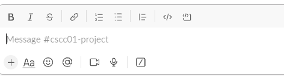
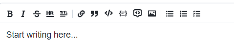
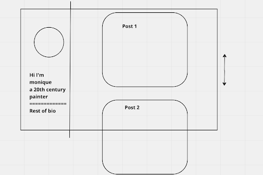

# Obelisk

 > _Note:_ This document is meant to be written during (or shortly after) your initial planning meeting.     
 > It does not really make sense for you to edit this document much (if at all) while working on the project - Instead, at the end of the planning phase, you can refer back to this document and decide which parts of your plan you are happy with and which parts you would like to change.

## Iteration 02

 * Start date: 6/26/2023
 * End date: 7/7/2023

## Process

Quick Introduction to the process

#### Changes from previous iteration

List the most significant changes you made to your process (if any).

 * At most 3 items
 * Start with the most significant change
 * For each change, explain why you are making it and what you are hoping to achieve from it
 * Ideally, for each change, you will define a clear success metric (i.e. something you can measure at the end of the iteration to determine whether the change you made was successful)

Pull requests can prevent problems from occuring on main by having a reviewer make sure the code is viable. It also lets the team member illustrate their thought process to the team, potentially allowing them to catch errors.
We've come to realize that some tasks are comparative lighter or less visible on the front-end. Therefore, we have decided to implement lighter tasks along with bigger features so that it doesn't get cluttered up

 > *Note:* If you are not making any changes to your process, it means that you are happy with all of the decisions you made in the previous iterations.
 > In this case, list what you consider to be the most significant process decisions your team made. For each decision, explain why you consider it successful, and what success metric you are using (or could use) to assert that the decision is successful.

#### Roles & responsibilities

Describe the different roles on the team and the responsibilities associated with each role.

Every person is able to take on every role. When we create a feature we take on the role of working on backend, frontend, and database if necessary. 

#### Events

Describe meetings (and other events) you are planning to have:

 Meetings will be held online over Discord for everyone to report their current progress to the team and discuss any problems encountered. Team members may also request to have a coding session during meetings and schedule with the team.

#### Artifacts

List/describe the artifacts you will produce in order to organize your team.       

 * Artifacts can be To-do lists, Task boards, schedule(s), etc.
 * We want to understand:
   * How do you keep track of what needs to get done?
   * How do you prioritize tasks?
   * How do tasks get assigned to team members?

We maintain a kanban board and a product backlog to facilitate scrum work.
We create tasks as user stories and use standups to track their progress daily.
Task difficulty is assigned through planning poker and team members decide which task they would like to do. 

#### Git / GitHub workflow

Describe your Git / GitHub workflow.     
Essentially, we want to understand how your team members share a codebase and avoid conflicts.

 * Be concise, yet precise.      
For example, "we use pull-requests" is not a precise statement since it leaves too many open questions - Pull-requests from where to where? Who reviews the pull-requests? Who is responsible for merging them? Etc.

 * If applicable, specify any naming conventions or standards you decide to adopt.

 * Don't forget to **explain why** you chose this workflow.

We use git flow to organize our workflow. This helps to limit merge conflicts and keep the history mostly linear. 
We adopt a naming convention where all branches are 'feature/{task}' or 'fix/'. This makes it easy to convey what's being done at a high level.
 We help keep commits understandable by frequently collaborating to ensure that whatever we're working on is not incomprehensible. 
We will use pull requests for any feature branch to merge into main and get at least one person who didn't write any of the commits to be a reviewer. This ensures that people know every aspect of the codebase which is important for our shared responsibility culture.

## Product

_This entire section is mandatory._

#### Goals and tasks

 * Describe your goals for this iteration and the tasks that you will have to complete in order to achieve these goals.
 * Order the items from most to least important.
 * Feel free (but not obligated) to specify some/all tasks as user stories.

One of the major goals of this sprint is to create a design language that all of our team can work towards together. We need to decide between multiple UI tools and make it easy to contribute to the design. This feature creates a smoother website that is more smoothed and easy to use.
Another goal is to work on documentation since the application is growing such that we no longer understand every line, and we need to make sure that we can continue to work on the project without having to relearn everything.
One of the major features we want to implement is a core flow of the site. That means getting on the site, seeing posts, logging in, and posting a post or comment yourself. This should all work completely and be easy to use.
We would also like to implement a basic search feature that allows users to search for posts by title or content. This will be a useful feature for users to find posts that they are interested in.

#### Artifacts

List/describe the artifacts you will produce in order to present your project idea.

 * Artifacts can be text, code, images, videos, interactive mock-ups and/or any other useful artifact you can think of.
 * Make sure to explain the purpose of each artifact (i.e. Why is it on your to-do list? Why is it useful for your team?)
 * Be concise, yet precise.         
   For example: "Build the website" is not precise at all, but "Build a static home page and upload it somewhere, so that it is publicly accessible" is much clearer.

- The post creation page uses a similar toolbar to Slack and similar apps for people who do not know markdown text format to create posts with ease.

- Slack Toolbar

- Obelisk Toolbar

- Page for users to personalize their biography and view their personal posts

- Blueprint for user profile page