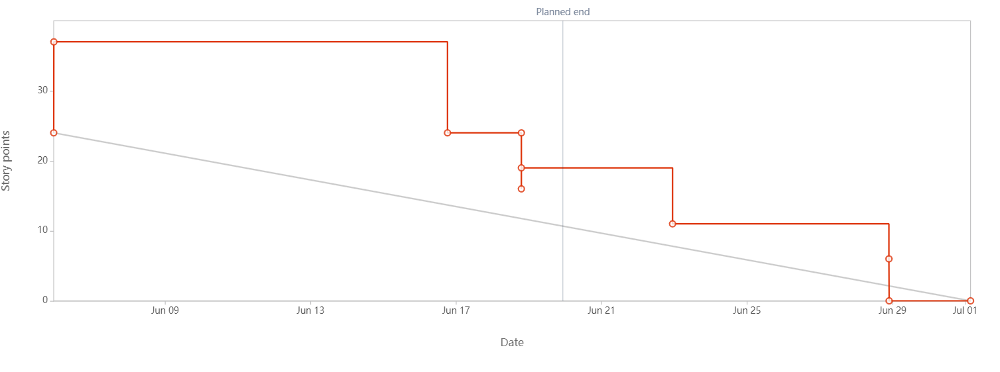
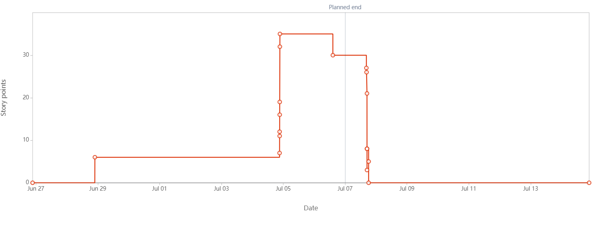
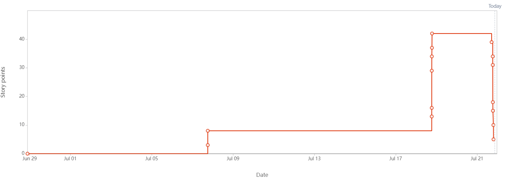

### Sprint 1 Burndown Chart

### Sprint 2 Burndown Chart

### Sprint 3 Burndown Chart

### Comments
For every sprint, our team plans to reach a planned velocity of 40 story points (8 points per each
team member).
Sprint 1 had a velocity that ended up being 37 story points
of tasks. Sprint 2 had a velocity of 27 story points of tasks
Our velocity was returning to near what we expected with the conclusion of midterms