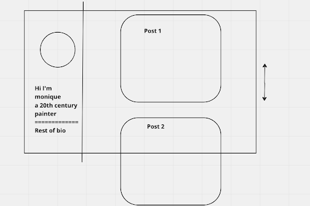
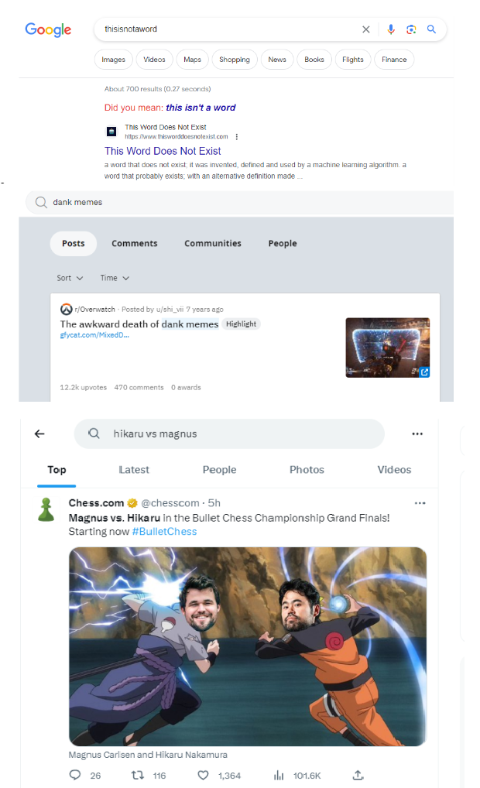

# Obelisk

## Iteration 03

 * Start date: 7/10/2023
 * End date: 7/21/2023

## Process

### Changes from previous iteration

We decided on a consistent design language and improved the documentation on our API and project in general. This will make it a lot easier to remove confusion for future features. Addtionally, the process to add features in the future will be a lot smoother as a result.

### Roles & responsibilities

Every person is able to take on every role. When we create a feature we take on the role of working on backend, frontend, and database if necessary.

### Events

Meetings will be held online over Discord for everyone to report their current progress to the team and discuss any problems encountered. Team members may also request to have a coding session during meetings and schedule with the team.
We had a meeting in person in addition to the discord meeting to perform planning poker and touch bases.

### Artifacts

We maintained a kanban board and a product backlog to facilitate scrum work.
We create tasks as user stories and use standups to track their progress daily.
Task difficulty is assigned through planning poker and team members decide which task they would like to do.

### Git / GitHub workflow

We used git flow to organize our workflow. This helps to limit merge conflicts and keep the history mostly linear.
We adopted a naming convention where all branches are 'feature/{task}' or 'fix/'. This makes it easy to convey what's being done at a high level.
We help keep commits understandable by frequently collaborating to ensure that whatever we're working on is not incomprehensible.
We will use pull requests for any feature branch to merge into main and get at least one person who didn't write any of the commits to be a reviewer. This ensures that people know every aspect of the codebase which is important for our shared responsibility culture.

## Product

### Goals and tasks

One of the major goals of this sprint is to create a design language that all of our team can work towards together. We need to decide between multiple UI tools and make it easy to contribute to the design. This feature creates a smoother website that is more smoothed and easy to use.
Another goal is to work on documentation since the application is growing such that we no longer understand every line, and we need to make sure that we can continue to work on the project without having to relearn everything.
One of the major features we want to implement is a core flow of the site. That means getting on the site, seeing posts, logging in, and posting a post or comment yourself. This should all work completely and be easy to use.
We would also like to implement a basic search feature that allows users to search for posts by title or content. This will be a useful feature for users to find posts that they are interested in.

### Artifacts

- Blue print for profile page for users to personalize their biography and view their personal posts, inspired by instagram profile view
	- 
	- 

- Recommendation page layout draws inspiration from platforms like Facebook. Each suggested post displays the title, a brief snippet, the post date, author, and a reason for its recommendation, enhancing user engagement
- 

- Search page layout was designed based on simplicity and structure from reputable sources like Google, Reddit, and Twitter (i.e. for each record, it includes title, description, date, and user metadata)
- 