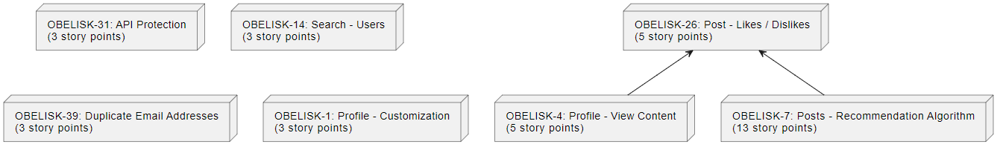

### Network Diagram for Sprint 3

- **User Story 1:** OBELISK-31: API Protection - This task is estimated to have 3 story points. It is independent relative to other stories in Sprint 3. 
- **User Story 2:** OBELISK-14: Search - Users - This task is estimated to have 3 story points. It is independent relative to other stories in Sprint 3. 
- **User Story 3:** OBELISK-39: Duplicate Email Addresses - This task is estimated to have 3 story points. It is independent relative to other stories in Sprint 3. 
- **User Story 4:** OBELISK-1: Profile - Customization - This task is estimated to have 3 story points. It is independent relative to other stories in Sprint 3. 
- **User Story 5:** OBELISK-26: Post - Likes / Dislikes - This task is estimated to have 5 story points. It is independent relative to other stories in Sprint 3. 
- **User Story 6:** OBELISK-4: Profile - View Content - This task is estimated to have 5 story points. It should only start after User Story 5 (Posts - Likes / Dislikes) is complete.
- **User Story 7:** OBELISK-7: Posts - Recommendation Algorithm - This task is estimated to have 13 story points. It should only start after User Story 5 (Posts - Likes / Dislikes) is complete.

In the context of agile, we should measure the critical path with story points where a path is a sequence of nodes, and the sequence that accumulates the highest number of story points is considered critical. In our case, the critical path starts with User Story 5 (Post - Likes / Dislikes), followed by User Story 6 (Profile - View Content), and finally User Story 7 (Posts - Recommendation Algorithm). This is because the total count of story points is 5+5+13=23, which is the highest relative to other paths.

Although we identified the critical path, that doesn't mean we must focus only on those nodes. Rather, we should also consider User Story 1 (API Protection), User Story 2 (Search - Users), User Story 3 (Duplicate Email Addresses), and User Story 4 (Profile - Customization). These are independent nodes which have no dependencies. These four nodes are estimated to have a low story point count of 3 each. This favors the idea that we should focus on the main dependency, which is likes/dislikes for posts in order to provide ourselves with ample time for the latter dependencies (i.e. the largest story point user story which is the recommendation algorithm as it has a dependency on likes/dislikes).

During the last sprint, we learned the importance of not pulling additional user stories in advance. Instead, we will use any extra time to optimize our code, and prepare for the next sprint whether it be cleaning up the backlog, doing more research, or refining user stories.
