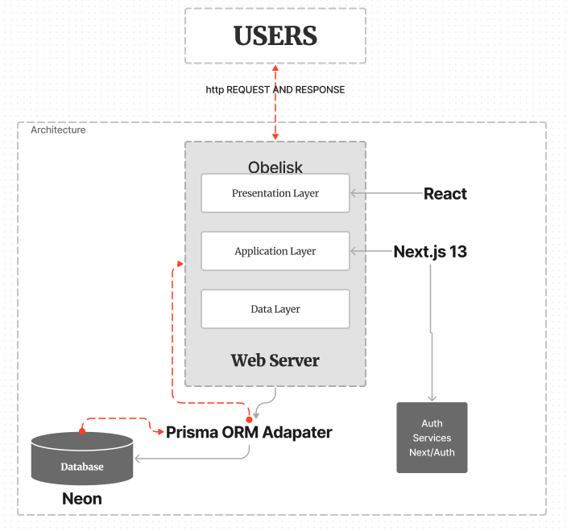

# Obelisk Documentation

* **Title:** System Design for Obelisk
* **Prepared by:** Eric Fan, Arnav Priyadarshi, Jason Xia, Arwin Fong, Harrick Cheong 
* **Date:** 2023-07-21

---

## Table of Contents

1. [Workload Distribution](#Workload-Distribution)
2. [Environment](#Environment)
3. [Frontend](#Frontend)
   - [Dependencies](#Dependencies)
   - [Responsibilities](#Responsibilities)
   - [Potential Failures](#Potential-Failures)
4. [Backend](#Backend)
   - [Responsibilities](#Responsibilities-1)
   - [Potential Failures](#Potential-Failures-1)
5. [Authentication Service](#Authentication-Service)
   - [Responsibilities](#Responsibilities-2)
   - [Potential Failures](#Potential-Failures-2)
6. [Database](#Database)
   - [Responsibilities](#Responsibilities-3)
   - [Potential Failures](#Potential-Failures-3)
7. [Deployment](#Deployment)
8. [CI](#CI)
9. [System Design Diagram](#System-Design-Diagram)

# Workload Distribution
Everyone is responsible for maintaining all of the components, so we’re all collaborators on it.
# Environment
Ideally we’d run our backend on a Dockerized Ubuntu Linux VM. This is running a Nodejs environment and responding to requests over the internet on an SSL encrypted connection. It should be listening on a certain port and responding to traffic with our site on HTTPS.

# Frontend
The frontend of the site was built with Tailwind CSS and React. Some component libraries may be used to provide utilities like skeleton loaders and loading spinners.
Dependencies:
React-markdown to render markdown and let our users write and read posts & comments with markdown

Responsibilities:
 - Provide a responsive site to our clients
 - Provide a good user experience by using industry conventions, good accessibility practices, and making a fast experience by showing loading symbols while fetching data and doing smooth transitions

Potential Failures:
 - Problems with things loading or being hidden should be caught with extensive testing.

# Backend
We’re running a Next server in the backend that uses a mixture of rendering strategies to serve our users on the website.

Responsibilities:
 - Provide an API for our frontend to allow users to login, post, etc..
 - Serve the html for our pages

Potential Failures:
 - If Network errors, send 404 pages
 - If calls to services are unresponsive then we trigger an error in the rendered component and catch it in a react boundary

# Authentication Service
We use Next Auth to provide SSO options for our users.

Responsibilities:
 - This should give us back validated users.

Potential Failures:
 - If failure of authentication because there is no user to log in, then we should direct them to sign up
 - If Google/Github is down, then it’s out of our hands.

# Database
We use a managed cloud database called Neon that provides a Postgres instance for us to use. We’re on the free tier. We communicate with it in code using a Prisma ORM client that runs on our Next server.

Responsibilities:
 - Permanently store our user data

Potential Failures:
 - If you can’t connect, check if your Prisma can connect. This may be a missing env file, missing Prisma client, or network errors
 - Neon DBs have cold start problems. We can fix this by upgrading to the paid tier, or running a script to ping the db once every 5 minutes on the cloud.
 - Limited storage/compute is also solved by upgrading

# Deployment
Currently undecided but maybe Vercel, or AWS

# CI
Github Actions will be our continuous testing facility.

# CRC Cards
### User

| **Class** | **User** |
| --- | --- |
| **Responsibilities** | Create and manage account, follow other users, create posts, like posts |
| **Collaborations** | Post, Like, Follow |

### Post

| **Class** | **Post** |
| --- | --- |
| **Responsibilities** | Hold content of post (text, images, etc.), receive likes, be associated with a user |
| **Collaborations** | User, Like |

### Like

| **Class** | **Like** |
| --- | --- |
| **Responsibilities** | Associate with a user and a post |
| **Collaborations** | User, Post |

### Follow

| **Class** | **Follow** |
| --- | --- |
| **Responsibilities** | Associate between two users (follower and following) |
| **Collaborations** | User |

# Software Architectural Diagram

