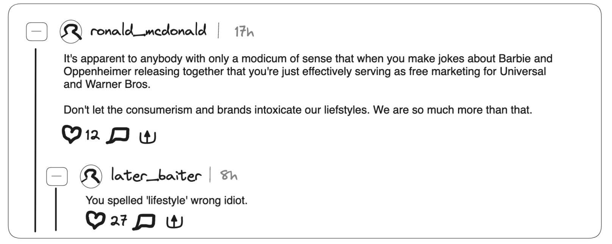

# Obelisk

## Iteration 04

 * Start date: 7/24/2023
 * End date: 8/4/2023

## Process

#### Changes from previous iteration

- No changes to process. 
- We're happy with our old changes like:
	- Good Pull requests: Can prevent problems from occurring on main by having a reviewer make sure the code is viable. It also lets the team member illustrate their thought process to the team, potentially allowing them to catch errors. Worked by helping us catch bad code.
- One hard and one easy task - We've come to realize that some tasks are comparatively lighter or less visible on the front-end. Therefore, we have decided to implement lighter tasks along with bigger features so that it doesn't get cluttered up. Worked by letting us do all tasks this sprint.

#### Roles & responsibilities

- Every person is able to take on every role. When we create a feature we take on the role of working on backend, frontend, and database if necessary. 

#### Events

-  Meetings will be held online over Discord for everyone to report their current progress to the team and discuss any problems encountered. 
- Team members may also request to have a coding session during meetings and schedule with the team.
- We had a meeting in person in addition to the discord meeting to perform planning poker and touch bases.

#### Artifacts

- We maintain a kanban board and a product backlog to facilitate scrum work.
- We create tasks as user stories and use standups to track their progress daily.
- Task difficulty is assigned through planning poker and team members decide which task they would like to do. 
- We make mockups to plan out the UI design of components

#### Git / GitHub workflow

- We use git flow to organize our workflow. This helps to limit merge conflicts and keep the history mostly linear. 
- We adopt a naming convention where all branches are 'feature/{task}' or 'fix/'. This makes it easy to convey what's being done at a high level.
 We help keep commits understandable by frequently collaborating to ensure that whatever we're working on is not incomprehensible. 
- We will use pull requests for any feature branch to merge into main and get at least one person who didn't write any of the commits to be a reviewer. This ensures that people know every aspect of the codebase which is important for our shared responsibility culture.

## Product

#### Goals and tasks

- One of the major goals of this sprint is to create a design language that all of our team can work towards together. We need to decide between multiple UI tools and make it easy to contribute to the design. This feature creates a smoother website that is more smoothed and easy to use.
- Another goal is to work on documentation since the application is growing such that we no longer understand every line, and we need to make sure that we can continue to work on the project without having to relearn everything.
One of the major features we want to implement is a recommendation algorithm. This will work on machine learning and serve as our complex addition for the extra mark. This would provide our users with relevant and personalized content for viewing.

#### Artifacts

- Below is a mockup of the comment portion. We implemented the ability to reply to a reply, allowing users to continue a thread of discussion.
This is a mockup of a post. "Ask Obelisk" was meant to be the "retweet" function. However, we ultimately decided not to include that into Obelisk.
	- 

- This is a mockup of a post. "Ask Obelisk" was meant to be the "retweet" function. However, we ultimately decided not to include that into Obelisk.
	- 